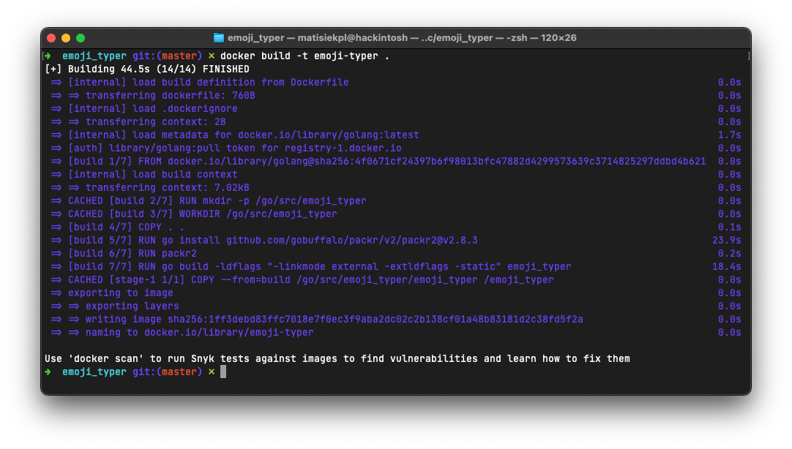
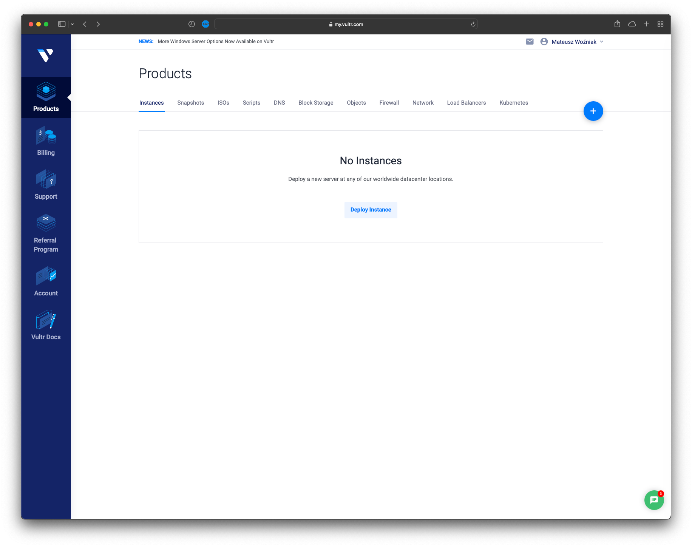
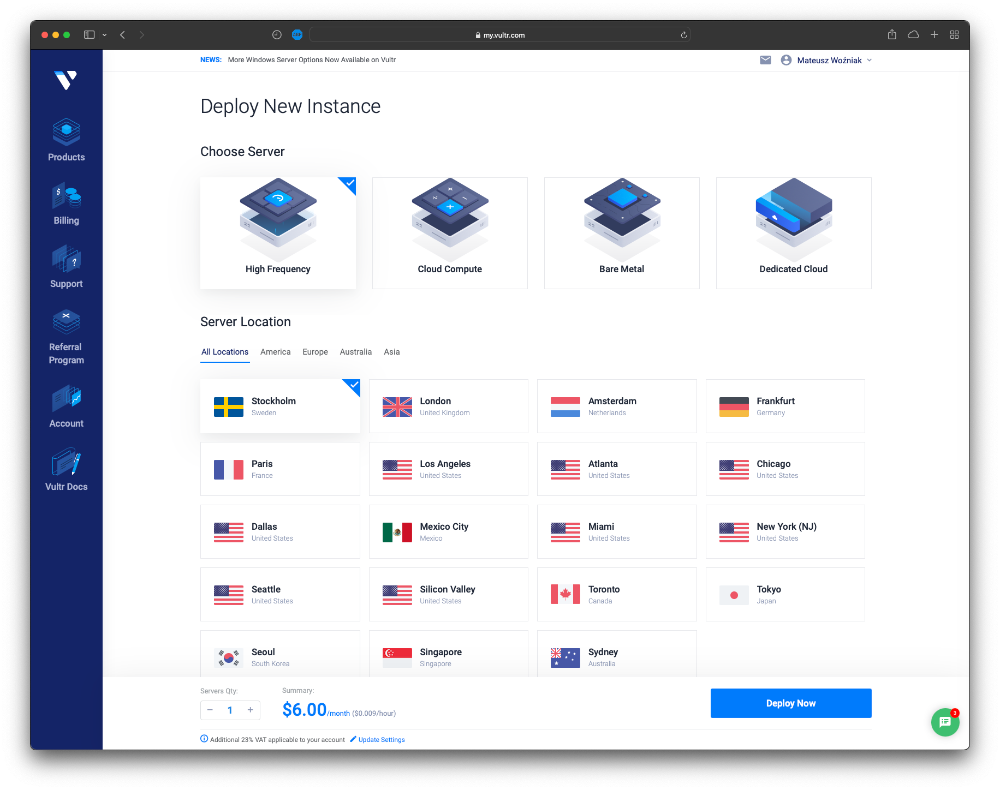
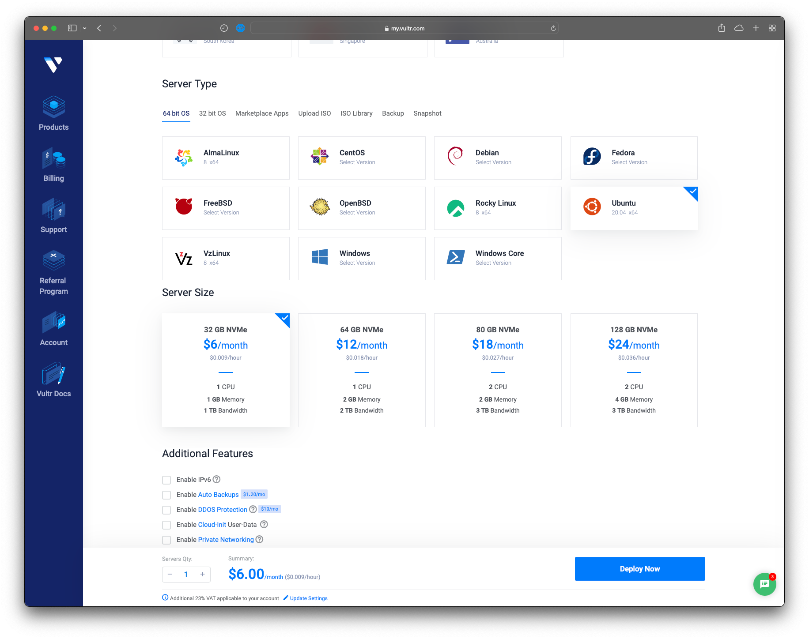

# Konteneryzacja aplikacji i wdrożenie na klaster Kubernetes
> Ten poradnik pokazuje w jaki sposób skonteneryzować aplikację webową napisaną w Go oraz wdrożyć ją na klaster Kubernetes postawiony na infrastrukturze dostawcy Vultr. 

## Krok 1
> Skonteneryzuj aplikację. Aplikację możemy spakować do tak zwanego kontenera. Jest to specjalne "opakowanie" na oprogramowanie, które pozwala uruchomić je zawsze w taki sam sposób, niezależnie od środowiska. W końcu możemy pożegnać teksty typu "Ale u mnie działa"

W tym celu tworzymy plik Dockerfile w głównym katalogu projektu
```dockerfile
FROM golang AS build
# utworz katalog roboczy
RUN mkdir -p /go/src/emoji_typer
# ustaw go jako aktualny katalog roboczy
WORKDIR /go/src/emoji_typer
# skopiuj kod do niego
COPY . .
# zainstaluj program pakujacy pliki statyczne Packr2
RUN go install github.com/gobuffalo/packr/v2/packr2@v2.8.3
# niech Packr2 spakuje pliki statyczne
RUN packr2 
# skompiluj program
RUN go build -ldflags "-linkmode external -extldflags -static" emoji_typer

# utworz nowy kontener, zawierajacy jedynie skompilowany plik z kodem maszynowym
FROM scratch
# skopiuj plik wykonywalny
COPY --from=build /go/src/emoji_typer/emoji_typer /emoji_typer
# powiedz Dockerowi, by podczas uruchamiania kontenera, wywolal ten plik
CMD ["/emoji_typer"]
```

## Krok 2
> Utwórz obraz kontenera i wypchnij go do rejestru kontenerów.

Kompilujemy kontener do jego obrazu (który potem stanowi podstawę do tworzenia kontenera na serwerze). Następnie zmieniamy jego nazwę (rejestr kontenerów wymaga prefixu zawierającego login użytkownika). Następnie wypychamy obraz do rejestru
```bash
$ docker build -t emoji-typer .
$ docker tag emoji-typer matisiekpl/emoji-typer
$ docker push matisiekpl/emoji-typer
```

## Krok 3
> Tworzenie serwera VPS u dostawcy Vultr

Po utworzeniu konta przechodzimy do panelu serwerów:


Klikamy "Deploy instance". Otwiera się panel zamawiania serwera. Wybieramy pulę serwerów wysokiej częstotliwości. Następnie wybieramy lokalizację. Sztokholm wydaje się rozsądny, bo nie jest zbyt daleko Polski (wybierając Stany Zjednoczone Ameryki można by było odczuć opóźnienia związane z tym, że transmisja musiałaby zostać przesłana przez infrastrukturę pod oceanem)


Następnie wybieramy system operacyjny. Wybrałem swój ulubiony czyli Ubuntu Server 20.04 LTS. Konfigurację maszyny wirtualnej wybieram 1 wersji 1vcpu/1gb ze względu na studencką cenę


