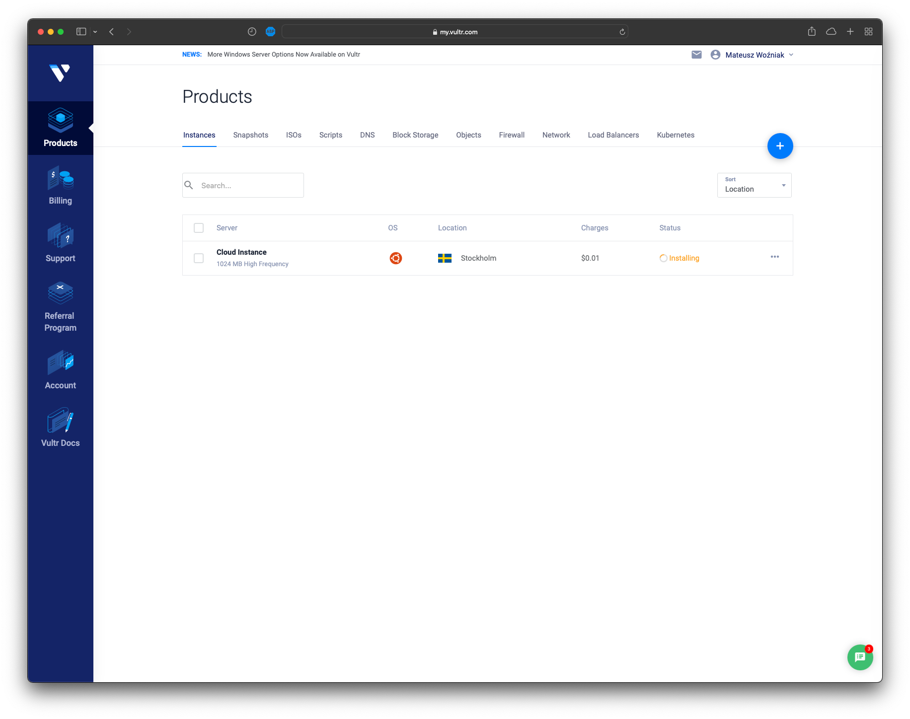
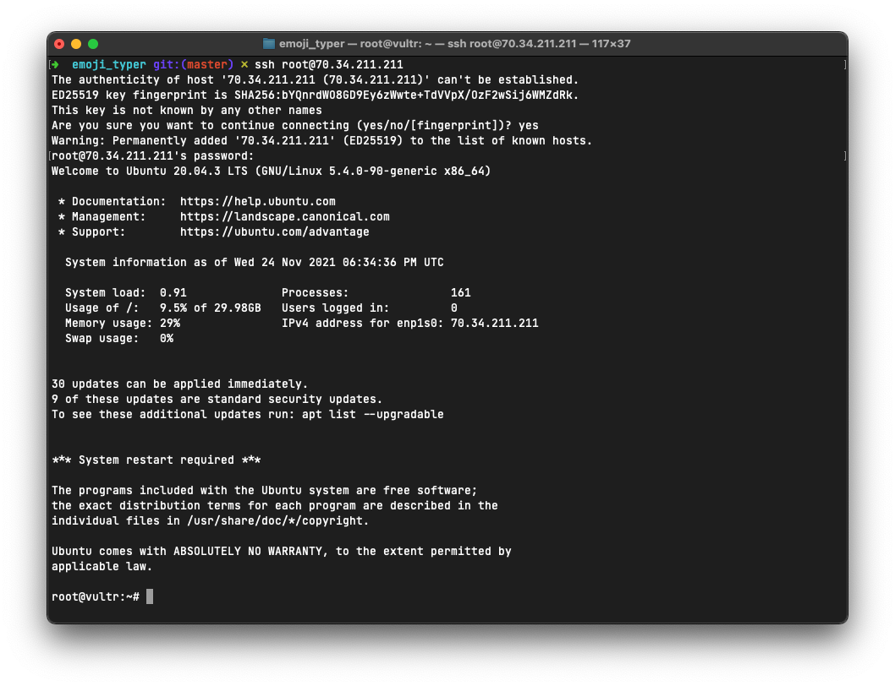
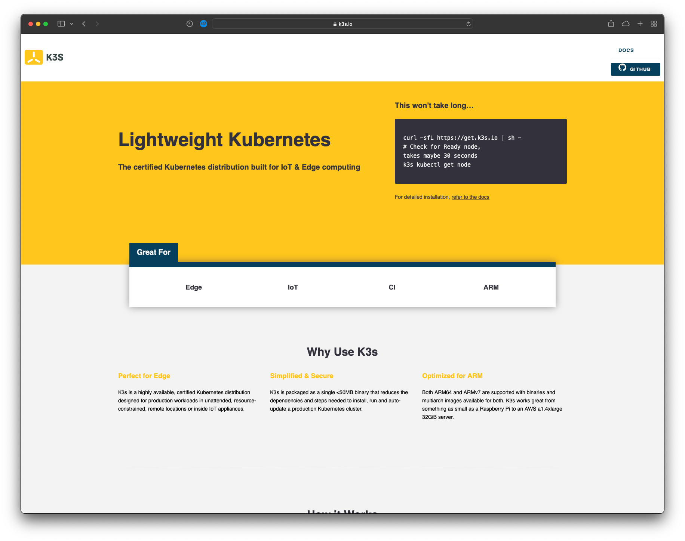

# Konteneryzacja aplikacji i wdrożenie na klaster Kubernetes
> Ten poradnik pokazuje w jaki sposób skonteneryzować aplikację webową napisaną w Go oraz wdrożyć ją na klaster Kubernetes postawiony na infrastrukturze dostawcy Vultr. 

## Krok 1
> Skonteneryzuj aplikację. Aplikację możemy spakować do tak zwanego kontenera. Jest to specjalne "opakowanie" na oprogramowanie, które pozwala uruchomić je zawsze w taki sam sposób, niezależnie od środowiska. W końcu możemy pożegnać teksty typu "Ale u mnie działa"

W tym celu tworzymy plik Dockerfile w głównym katalogu projektu
```dockerfile
FROM golang AS build
# utworz katalog roboczy
RUN mkdir -p /go/src/emoji_typer
# ustaw go jako aktualny katalog roboczy
WORKDIR /go/src/emoji_typer
# skopiuj kod do niego
COPY . .
# zainstaluj program pakujacy pliki statyczne Packr2
RUN go install github.com/gobuffalo/packr/v2/packr2@v2.8.3
# niech Packr2 spakuje pliki statyczne
RUN packr2 
# skompiluj program
RUN go build -ldflags "-linkmode external -extldflags -static" emoji_typer

# utworz nowy kontener, zawierajacy jedynie skompilowany plik z kodem maszynowym
FROM scratch
# skopiuj plik wykonywalny
COPY --from=build /go/src/emoji_typer/emoji_typer /emoji_typer
# powiedz Dockerowi, by podczas uruchamiania kontenera, wywolal ten plik
CMD ["/emoji_typer"]
```

## Krok 2
> Utwórz obraz kontenera i wypchnij go do rejestru kontenerów.

Kompilujemy kontener do jego obrazu (który potem stanowi podstawę do tworzenia kontenera na serwerze). Następnie zmieniamy jego nazwę (rejestr kontenerów wymaga prefixu zawierającego login użytkownika). Następnie wypychamy obraz do rejestru
```bash
$ docker build -t emoji-typer .
$ docker tag emoji-typer matisiekpl/emoji-typer
$ docker push matisiekpl/emoji-typer
```

## Krok 3
> Tworzenie serwera VPS u dostawcy Vultr

Po utworzeniu konta przechodzimy do panelu serwerów:


Klikamy "Deploy instance". Otwiera się panel zamawiania serwera. Wybieramy pulę serwerów wysokiej częstotliwości. Następnie wybieramy lokalizację. Sztokholm wydaje się rozsądny, bo nie jest zbyt daleko Polski (wybierając Stany Zjednoczone Ameryki można by było odczuć opóźnienia związane z tym, że transmisja musiałaby zostać przesłana przez infrastrukturę pod oceanem)


Następnie wybieramy system operacyjny. Wybrałem swój ulubiony czyli Ubuntu Server 20.04 LTS. Konfigurację maszyny wirtualnej wybieram 1 wersji 1vcpu/1gb ze względu na studencką cenę


Czekamy aż system się zainstaluje


Następnie łączymy się za pomocą protokołu SSH, używając danych z lewej kolumny




Jako dystrybucję platformy Kubernetes wybrałem lekki i szybki K3S od Ranchera


Instalujemy Kubernetes za pomocą komendy:
```bash
$ curl -sfL https://get.k3s.io | sh -
```


> W tym miejscu należałoby wytłumaczyć sposób organizacji zasobów w klastrze Kubernetes
> 
> Pod - to grupa kontenerów. Najczęściej pod zawiera jeden kontener z naszą aplikacją, choć możemy dodać ich więcej.
> 
> ReplicaSet - to zasób który zarządza tworzeniem/usuwaniem Podów. W zasobie ReplicaSet możemy zdefiniować docelową ilość Podów aplikacji. ReplicaSet będzie dążył do tego, aby aktualna liczba Podów była równa zadanej. 
>
> Deployment - to zasób który reprezentuje pełne wdrożenie aplikacji. Zarządza on ReplicaSetami. Ma również możliwość np. podmiany wersji aplikacji w ReplicaSetach
> 
> Service - to zasób zarządzający ruchem w środku klastra. Odbiera pakiety i przekazuje je do podów w ściśle określony sposób
> 
> Po co to wszystko? Przecież można by było uruchomić kontener ręcznie ---- owszem, można by było. Ale jeżeli do klastra dołączymy kolejne serwery, to Kubernetes będzie czuwał nad tym, aby aplikacja była równomiernie uruchomiona na wszystkich węzłach, a ruch był równomiernie dystrybuowany na wszystkie węzły (serwery podłączone do Kubernetes).

# Krok 3
> Utworzenie konfiguracji wdrożeniowej i zaaplikowanie jej na klaster

Teraz musimy utworzyć pliki konfigurcyjne. Dobrą praktyką jest tworzenie ich w repozytorium
Utwórzmy więc plik konfiguracyjny zawierający zasoby Deployment 

Plik: deployment.k8s.yaml
```yaml
apiVersion: apps/v1
kind: Deployment # typ zasobu
metadata:
  name: emoji-typer # nazwa zasobu
spec:
  selector:
    matchLabels:
      app: emoji-typer # Zasób Deployment będzie zarządzał ReplicaSetami, których etykieta app=emoji-typer
  replicas: 6 # Liczba podów w replice. Jeżeli mamy np. trzy serwery, to te 6 podów zostanie rozproszone na trzy serwery (czyli za pewne na każdy serwer będą przypadać dwa pody)
  template:
    metadata:
      labels:
        app: emoji-typer # ReplicaSety będą zawierać etykietę app=emoji-typer
    spec:
      containers:
        - name: emoji-typer
          image: matisiekpl/emoji-typer # Nazwa obrazu z kontenera
          ports:
            - containerPort: 3000 # Port, który kontener wystawia na świat
---
apiVersion: v1
kind: Service
metadata:
  name: emoji-typer # tym razem tworzymy jednak zasób Service
spec:
  selector:
    app: emoji-typer # kierujemy pakiety z zewnątrz do podów, których etykieta app=emoji-typer
  type: NodePort # typ kierowania, NodePort wystawia jeden port na świat
  ports:
    - protocol: TCP # protokół pakietów
      nodePort: 30123 # port, który jest wystawiany na świat na zewnątrz VPS
      targetPort: 3000 # port docelowy, czyli ten, na którym nasłuchuje Pod
      port: 30123 # port ogólny, dla kierowania NodePort równy nodePort
```
Taki plik commitujemy i wypychamy do repozytorium.
Następnie możemy go pobrać na serwerze, po czym wywołać komendę `kubectl apply`, aby konfiguracja została zastosowana na klastrze.

